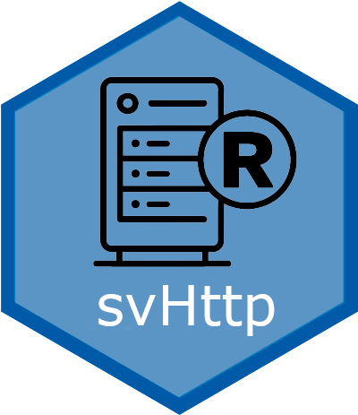

<!-- README.md is generated from README.Rmd. Please edit that file -->

```{r, include=FALSE}
knitr::opts_chunk$set(collapse = TRUE, comment = "#>",
  fig.path = "man/figures/README-", out.width = "100%")
```

# 'SciViews::R' - Socket Server <a href="https://www.sciviews.org/svSocket"></a>

<!-- badges: start -->
[](https://github.com/SciViews/svHttp/actions/workflows/R-CMD-check.yaml)
[](https://app.codecov.io/gh/SciViews/svHttp?branch=main)
[](https://cran.r-project.org/package=svHttp)
[](https://sciviews.r-universe.dev/svHttp)
[](https://www.gnu.org/licenses/gpl-2.0.html)
[](https://www.tidyverse.org/lifecycle/#stable)
<!-- badges: end -->

A HTTP server that allows for another process to connect to R and to interact with it as if it was at the command line directly.

## Installation

The latest stable version of {svHttp} can simply be installed from [CRAN](http://cran.r-project.org):

``` r
install.packages("svHttp")
```

You can also install the latest development version. Make sure you have the {remotes} R package installed:

``` r
install.packages("remotes")
```

Use `install_github()` to install the {svHttp} package from GitHub (source from **master** branch will be recompiled on your machine):

``` r
remotes::install_github("SciViews/svSocket")
```

R should install all required dependencies automatically, and then it should compile and install {svHttp}.

Latest devel version of {svHttp} (source + Windows binaries for the latest stable version of R at the time of compilation) is also available from [appveyor](https://ci.appveyor.com/project/phgrosjean/svHttp/build/artifacts).

## Further explore {svHttp}

You can get further help about this package this way: Make the {svHttp} package available in your R session:

``` r
library("svHttp")
```

Get help about this package:

``` r
library(help = "svHttp")
help("svHttp-package")
vignette("svHttp") # None is installed with install_github()
```

For further instructions, please, refer to these help pages at <https://www.sciviews.org/svHttp/>.

## Code of Conduct

Please note that the {svHttp} project is released with a [Contributor Code of Conduct](https://contributor-covenant.org/version/2/0/CODE_OF_CONDUCT.html). By contributing to this project, you agree to abide by its terms.

## Note to developers

This package used to be developed on R-Forge in the past. However, the latest [R-Forge version](https://r-forge.r-project.org/projects/sciviews/) was moved to this GitHub repository on 2016-03-18 (SVN version 569). **Please, do not use R-Forge anymore for SciViews development, use this Github repository instead.**
